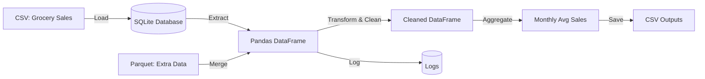

# 🛒 Grocery Store ETL Pipeline

A lightweight, containerised **_ETL pipeline_** built with Python, pandas, and SQLite.
The project demonstrates real-world data engineering practices: ETL structure, logging, validation, testing, and CI/CD with GitHub Actions.

[](https://github.com/haylzrandom/grocery-pipeline/actions/workflows/ci.yml)
[](https://github.com/haylzrandom/grocery-pipeline/actions/workflows/tests.yml)
[](https://github.com/haylzrandom/grocery-pipeline/actions/workflows/full-run.yml)

## 🛠 Tech Stack


## 🔄 ETL Flow Overview



## 🚀 Features

- Extracts CSV + Parquet grocery data into SQLite
- Cleans, transform, and aggregates with pandas
- Structured logging (console + file)
- Data validation (missing/empty file checks)
- Unit and integration tests with pytest
- Docker and Docker compose for reproducibility
- CI/CD with Github Actions

## 🐳 Running the pipeline

### Build containers

```bash
docker compose build
```

### Run pipeline

```bash
docker compose run --rm pipeline
```

### Dry run (no write out, just logs)

```bash
docker compose run --rm dry-run
```

Outputs:

- `data/clean_data.csv`

- `data/agg_data.csv`

- `logs/pipeline.log`

## 🧪 Testing

Run all tests:

```bash
docker compose run --rm tests
```

## Documentation

For further examples and details of the project:

- [📜 Example Logs](docs/LOG_EXAMPLES.md)
- [📊 Example Outputs](docs/OUTPUTS.md)
- [👩‍💻 Developer Guide](docs/DEVELOPER_GUIDE.md)
